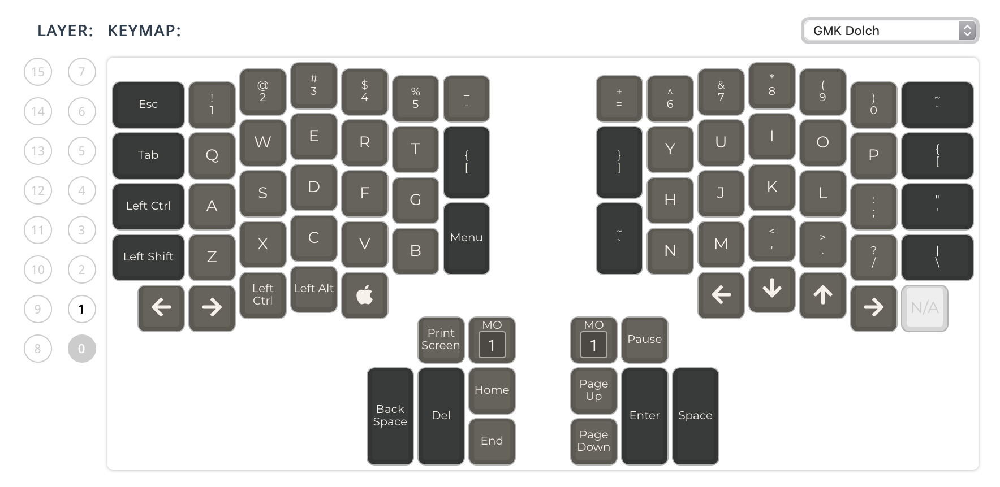
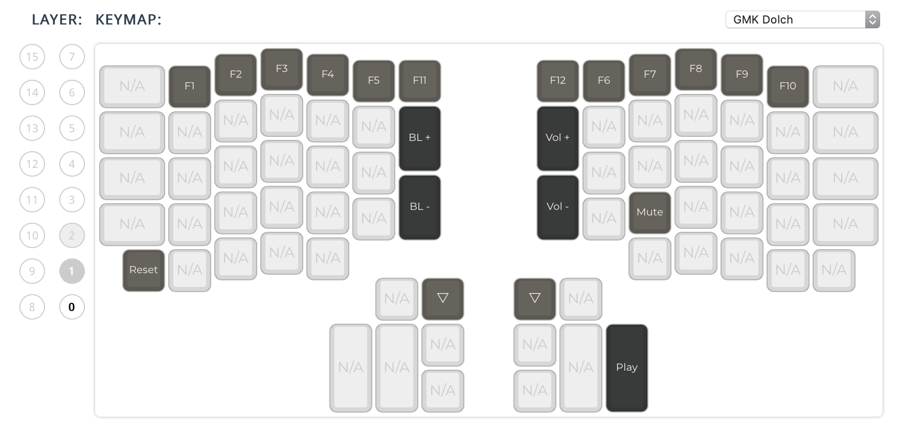

# My custom Ergodox Infinity layout for QMK

1. Get firmware from https://github.com/qmk/qmk_firmware
2. Clone this repo to `/path/to/cloned/qmk-firmare/keyboards/ergodox_infinity/keymaps/`
3. Connect left half, push the DFU mode button at the back, and run `make ergodox_infinity:qmk-ergodox-infinity-keymap:dfu-util`
4. Connect right half, push the button, and run `make ergodox_infinity:qmk-ergodox-infinity-keymap:dfu-util MASTER=right`
5. Enjoy

